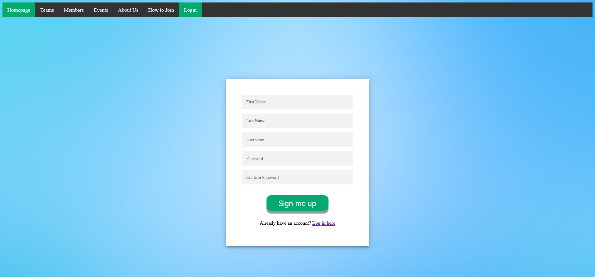
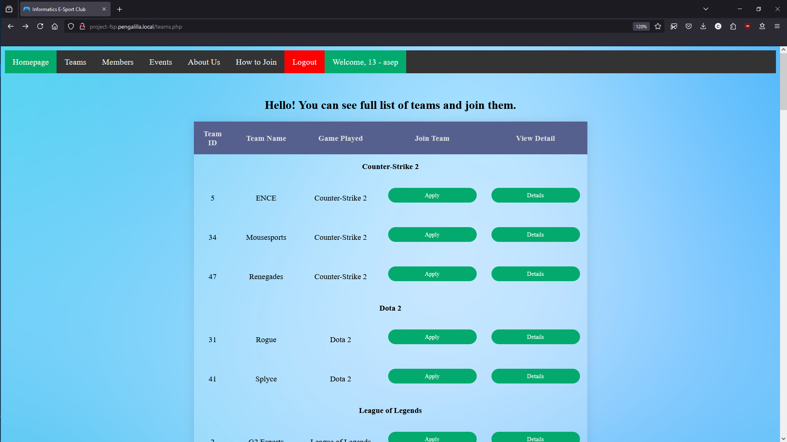
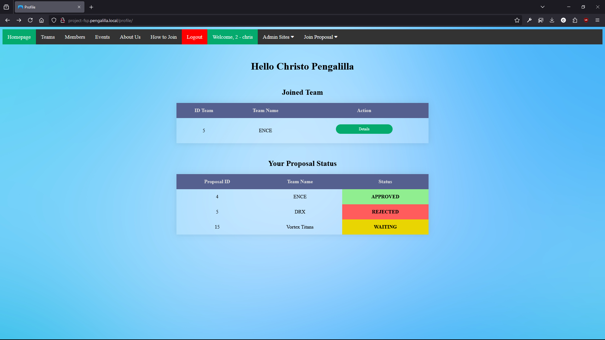
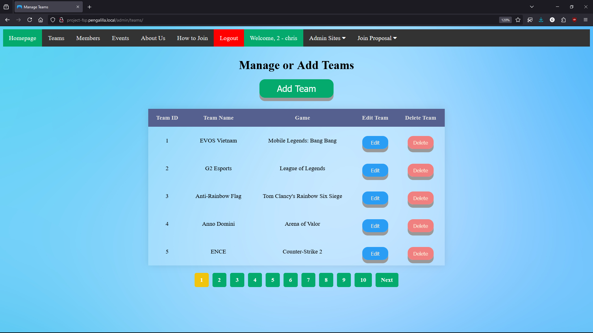
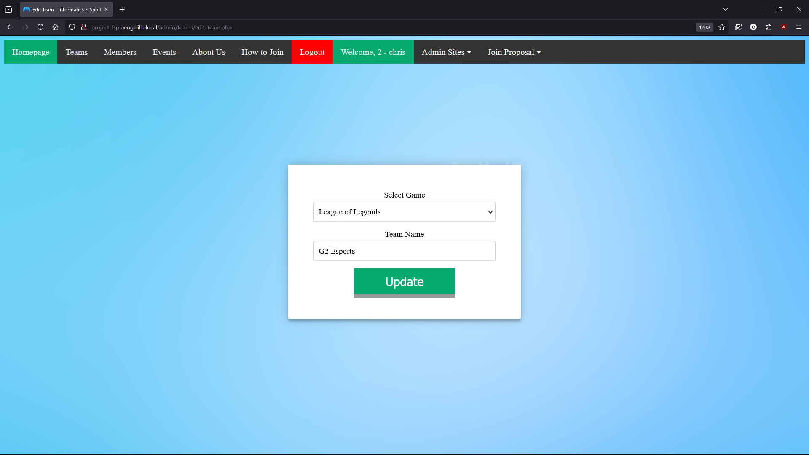
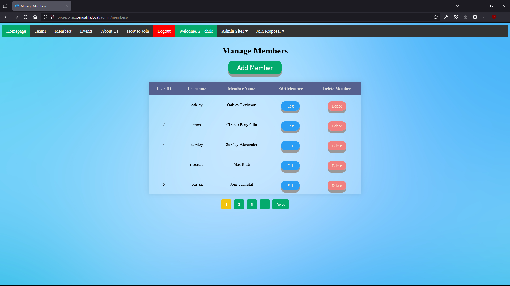
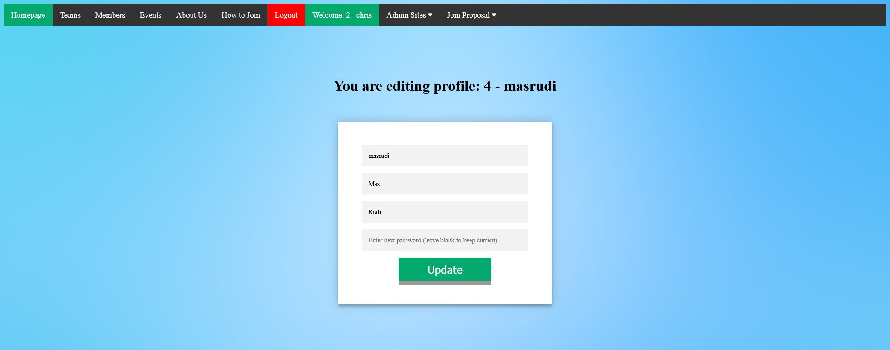
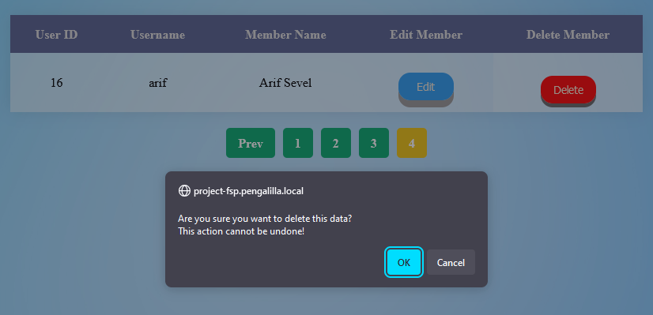

# Documentation of Full-Stack Project "E-Sport Management Website"

## Table of Contents
- [Documentation of Full-Stack Project "E-Sport Management Website"](#documentation-of-full-stack-project-e-sport-management-website)
  - [Table of Contents](#table-of-contents)
  - [Part I: Guest](#part-i-guest)
  - [Part II: Member](#part-ii-member)
    - [Joining a team](#joining-a-team)
  - [Part III: Admin](#part-iii-admin)
    - [Teams](#teams)
    - [Members](#members)
## Part I: Guest

"Guest" means users who do not have an account registered yet. Guest can explore the teams (including team's details), events, and about page only. It is indicating that Guest users have least access to the site. If users want to join a team, they must register an account through **Sign Up** page.

**Sign Up** can be done by clicking **Login**, then click <u>**Sign up here**</u>.

*The "Sign Up here" hyperlink below Login Button.*

After pressing the hyperlink, users will be taken to a page where one must fill all required fields, such as: first name, last name (optional), username, password, and password confirmation. 

If password confirmation does not match with password field, users can not proceed. But if does, user will redirected to login page. After registering an account, we move to the next step.

## Part II: Member

"Member" is a default role when an account is registered. With a member account, users can do such as:

###  Joining a team
  
  Users can apply to be on its personnel. To become one of the team member, one must select a click **Teams** from top navigation bar. In **Teams** page, there are lots of teams that available to join. Choose one of them, and click **Details** if neccessary, and then click **Apply** button. User will be taken to the application form, where they need to fill out an application proposal.

  
  *You can click **Details** to see team's details. And then you may send application through **Apply** button*

  Please take a note that users **HAVE to fill** the application form. Write a short description about applicant at **maximum 100 CHARACTERS (not words)**. For example, users can describe about their favorite roles, main agents/heroes, etc. After done with it, users may send it by clicking **Apply** button.

  
  ***Example only**. Fill the application form with short description. You may or may not include a contact (optional of course).*

  

  After you send the application, admins need to review it. Then decide to approve or reject the application. If the application is approved, you are one of the team's member. If rejected, you can apply again and may improved the application proposal. You can track application proposal in the profile page by clicking **Profile**, the green button (with your id - username) right side of **Logout** button. 

  
  *You can see you application status in **Profile** page.*

## Part III: Admin

"Admin" is the most *powerful* role in this site. As admin, users can manage (create, update or edit, and delete) all categories in this site, such as: Teams, Members, Events, Games, Achievements, and Event-Teams (teams who joined specific events). Admins also have rights to revoke (or disband) teams, or delete and ban users. We have provided more detailed information for each categories below:

###  Teams

When admin accessing `/admin/teams`, the page will show all teams' name, alongside with two options: Edit and Delete.

You can choose which team you do want to edit or delete. To edit, simply click the blue **Edit** button, and you will be taken to edit page:

You can change the team's main game and/or edit the team's name. After you are done with editing, click the **Update** button to save your change(s).

###  Members

When admin accessing `/admin/members/`, the page will show all members' id, username, full name, and action either edit or delete the member. 

In edit page, admin can change their username, first name, last name, or changing the password. If admin leave the password fill blank, the current password will remain not changed.

If admin want to delete a member profile, click delete. And click OK to confirm deletion on pop-up alert.

