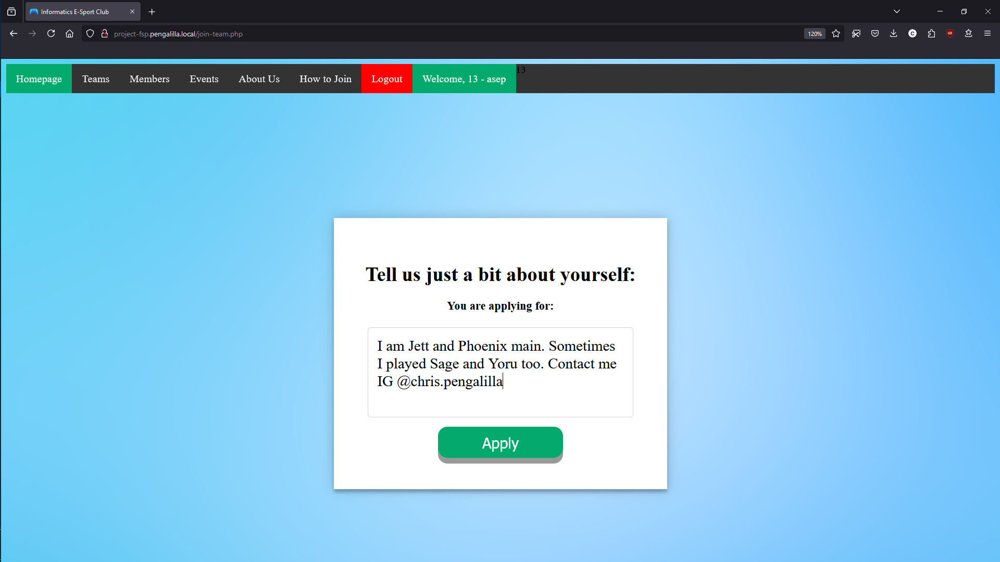
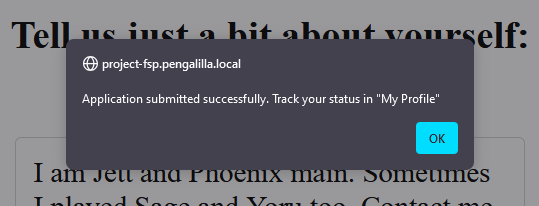
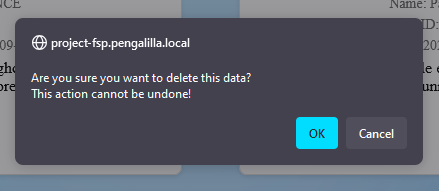

Documentation of Full-Stack Project "E-Sport Management Website"
===

# Table of Contents
- [Documentation of Full-Stack Project "E-Sport Management Website"](#documentation-of-full-stack-project-e-sport-management-website)
- [Table of Contents](#table-of-contents)
- [Part I: Guest](#part-i-guest)
- [Part II: Member](#part-ii-member)
  - [Joining a team](#joining-a-team)
- [Part III: Admin](#part-iii-admin)
  - [Teams](#teams)
  - [Members](#members)
  - [Events](#events)
  - [Games](#games)
  - [Achievements](#achievements)
  - [Event-Teams](#event-teams)

# Part I: Guest

"Guest" refers to users who do not yet have a registered account. Guests can explore teams (including team details), events, and the "About" page only. This indicates that Guest users have the least access to the site. If users want to join a team, they must register an account through the **Sign Up** page.

**Sign Up** can be done by clicking **Login**, then clicking <u>**Sign up here**</u>.

*The "Sign Up here" hyperlink below the Login button.*

After clicking the hyperlink, users will be taken to a page where they must fill out all required fields, such as: first name, last name (optional), username, password, and password confirmation. 

If the password confirmation does not match the password field, users cannot proceed. However, if it matches, the user will be redirected to the login page. After registering an account, we move to the next step.

# Part II: Member

"Member" is the default role assigned when an account is registered. With a member account, users can perform the following actions:

## Joining a team

Users can apply to join a team. To become a team member, the user must select **Teams** from the top navigation bar. On the **Teams** page, there are numerous teams available to join. Select one and click **Details** if necessary, and then click the **Apply** button. The user will be taken to an application form where they need to fill out an application proposal.

*Click **Details** to view team details. Then you can send an application through the **Apply** button.*

Please note that users **MUST fill out** the application form. Write a short description of the applicant with a maximum of 100 CHARACTERS (not words). For example, users can describe their favorite roles, main agents/heroes, etc. After completing the form, users may submit it by clicking the **Apply** button.

***Example only**. Fill out the application form with a brief description. You may optionally include a contact.*

After submitting the application, admins need to review it and decide whether to approve or reject the application. If the application is approved, the user becomes a team member. If rejected, the user can reapply and improve the application proposal. Users can track the application status on the profile page by clicking **Profile**, the green button (with your ID - username) to the right of the **Logout** button. 

*View your application status on the **Profile** page.*

# Part III: Admin

"Admin" is the most *powerful* role on this site. As an Admin, users can manage (create, update, edit, and delete) all categories on this site, including Teams, Members, Events, Games, Achievements, and Event-Teams (teams participating in specific events). Admins also have the rights to revoke (or disband) teams, delete users, and ban users. More detailed information for each category is provided below:

## Teams

When an Admin accesses `/admin/teams`, the page displays all team names alongside two options: Edit and Delete.

Admins can choose which team to edit or delete. To edit, simply click the blue **Edit** button, which leads to the edit page:

Admins can change the team's main game and/or edit the team's name. After editing, click the **Update** button to save changes.

## Members

When an Admin accesses `/admin/members/`, the page displays all members' IDs, usernames, full names, and actions (Edit or Delete).

On the edit page, Admins can change usernames, first names, last names, or passwords. If the password field is left blank, the current password remains unchanged.

To delete a member profile, click **Delete** and confirm the action in the pop-up alert.

## Events

When an Admin accesses `/admin/events`, the page displays all event names, IDs, dates, and descriptions. Admins can edit or delete events.

On the edit page, Admins can change the event's name, date, or description.

To delete an event, click the delete button, and confirm the action in the pop-up alert.

## Games

When an Admin accesses `/admin/games`, the page displays all game names, IDs, and descriptions. Admins can edit or delete games.

On the edit page, Admins can change a game's name or description. Click **Update** to save changes.

To delete a game, click the delete button, and confirm the action in the pop-up alert.

## Achievements

When an Admin accesses `/admin/achievements`, the page displays all achievement names, the teams that achieved them, achievement IDs, acquisition dates, and descriptions. There is also a dropdown menu to filter achievements by team.

On the edit page, Admins can change the team that acquired the achievement, the achievement's name, acquisition date, and description.

To delete an achievement, click the delete button, and confirm the action in the pop-up alert.

## Event-Teams

Event-Teams is a category showing which teams are participating in specific events. This page only displays events with participating teams. There are no options to edit or delete Event-Teams entries.

